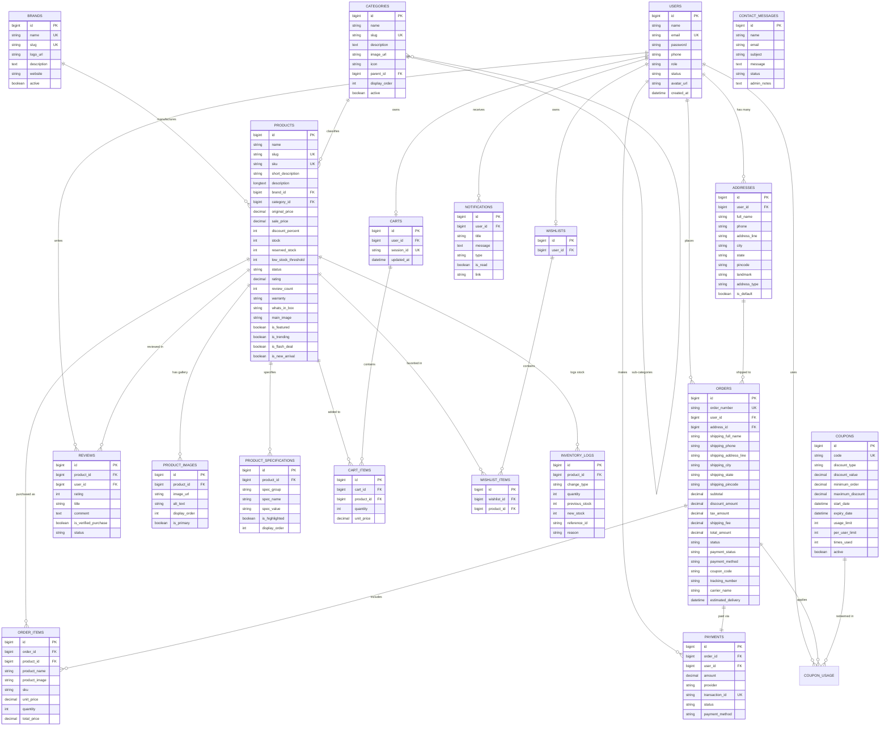

# TechVault Database Entity Relationship (ER) Diagram

```mermaid
erDiagram
    USERS ||--o{ ADDRESSES : "has many"
    USERS ||--o{ ORDERS : "places"
    USERS ||--o| CARTS : "owns"
    USERS ||--o| WISHLISTS : "owns"
    USERS ||--o{ REVIEWS : "writes"
    USERS ||--o{ NOTIFICATIONS : "receives"
    USERS ||--o{ COUPON_USAGE : "uses"
    USERS ||--o{ PAYMENTS : "makes"

    BRANDS ||--o{ PRODUCTS : "manufactures"
    CATEGORIES ||--o{ PRODUCTS : "classifies"
    CATEGORIES ||--o{ CATEGORIES : "sub-categories"

    PRODUCTS ||--o{ PRODUCT_IMAGES : "has gallery"
    PRODUCTS ||--o{ PRODUCT_SPECIFICATIONS : "specifies"
    PRODUCTS ||--o{ CART_ITEMS : "added to"
    PRODUCTS ||--o{ WISHLIST_ITEMS : "favorited in"
    PRODUCTS ||--o{ ORDER_ITEMS : "purchased as"
    PRODUCTS ||--o{ REVIEWS : "reviewed in"
    PRODUCTS ||--o{ INVENTORY_LOGS : "logs stock"

    CARTS ||--o{ CART_ITEMS : "contains"
    WISHLISTS ||--o{ WISHLIST_ITEMS : "contains"

    ORDERS ||--o{ ORDER_ITEMS : "includes"
    ORDERS ||--|| PAYMENTS : "paid via"
    ORDERS ||--o{ COUPON_USAGE : "applies"
    ADDRESSES ||--o{ ORDERS : "shipped to"

    COUPONS ||--o{ COUPON_USAGE : "redeemed in"

    USERS {
        bigint id PK
        string name
        string email UK
        string password
        string phone
        string role
        string status
        string avatar_url
        datetime created_at
    }

    ADDRESSES {
        bigint id PK
        bigint user_id FK
        string full_name
        string phone
        string address_line
        string city
        string state
        string pincode
        string landmark
        string address_type
        boolean is_default
    }

    CATEGORIES {
        bigint id PK
        string name
        string slug UK
        text description
        string image_url
        string icon
        bigint parent_id FK
        int display_order
        boolean active
    }

    BRANDS {
        bigint id PK
        string name UK
        string slug UK
        string logo_url
        text description
        string website
        boolean active
    }

    PRODUCTS {
        bigint id PK
        string name
        string slug UK
        string sku UK
        string short_description
        longtext description
        bigint brand_id FK
        bigint category_id FK
        decimal original_price
        decimal sale_price
        int discount_percent
        int stock
        int reserved_stock
        int low_stock_threshold
        string status
        decimal rating
        int review_count
        string warranty
        string whats_in_box
        string main_image
        boolean is_featured
        boolean is_trending
        boolean is_flash_deal
        boolean is_new_arrival
    }

    PRODUCT_SPECIFICATIONS {
        bigint id PK
        bigint product_id FK
        string spec_group
        string spec_name
        string spec_value
        boolean is_highlighted
        int display_order
    }

    PRODUCT_IMAGES {
        bigint id PK
        bigint product_id FK
        string image_url
        string alt_text
        int display_order
        boolean is_primary
    }

    CARTS {
        bigint id PK
        bigint user_id FK
        string session_id UK
        datetime updated_at
    }

    CART_ITEMS {
        bigint id PK
        bigint cart_id FK
        bigint product_id FK
        int quantity
        decimal unit_price
    }

    WISHLISTS {
        bigint id PK
        bigint user_id FK
    }

    WISHLIST_ITEMS {
        bigint id PK
        bigint wishlist_id FK
        bigint product_id FK
    }

    ORDERS {
        bigint id PK
        string order_number UK
        bigint user_id FK
        bigint address_id FK
        string shipping_full_name
        string shipping_phone
        string shipping_address_line
        string shipping_city
        string shipping_state
        string shipping_pincode
        decimal subtotal
        decimal discount_amount
        decimal tax_amount
        decimal shipping_fee
        decimal total_amount
        string status
        string payment_status
        string payment_method
        string coupon_code
        string tracking_number
        string carrier_name
        datetime estimated_delivery
    }

    ORDER_ITEMS {
        bigint id PK
        bigint order_id FK
        bigint product_id FK
        string product_name
        string product_image
        string sku
        decimal unit_price
        int quantity
        decimal total_price
    }

    PAYMENTS {
        bigint id PK
        bigint order_id FK
        bigint user_id FK
        decimal amount
        string provider
        string transaction_id UK
        string status
        string payment_method
    }

    REVIEWS {
        bigint id PK
        bigint product_id FK
        bigint user_id FK
        int rating
        string title
        text comment
        boolean is_verified_purchase
        string status
    }

    COUPONS {
        bigint id PK
        string code UK
        string discount_type
        decimal discount_value
        decimal minimum_order
        decimal maximum_discount
        datetime start_date
        datetime expiry_date
        int usage_limit
        int per_user_limit
        int times_used
        boolean active
    }

    INVENTORY_LOGS {
        bigint id PK
        bigint product_id FK
        string change_type
        int quantity
        int previous_stock
        int new_stock
        string reference_id
        string reason
    }

    NOTIFICATIONS {
        bigint id PK
        bigint user_id FK
        string title
        text message
        string type
        boolean is_read
        string link
    }

    CONTACT_MESSAGES {
        bigint id PK
        string name
        string email
        string subject
        text message
        string status
        text admin_notes
    }
```
